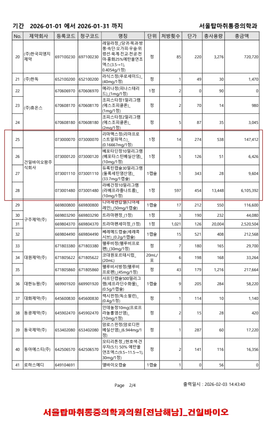
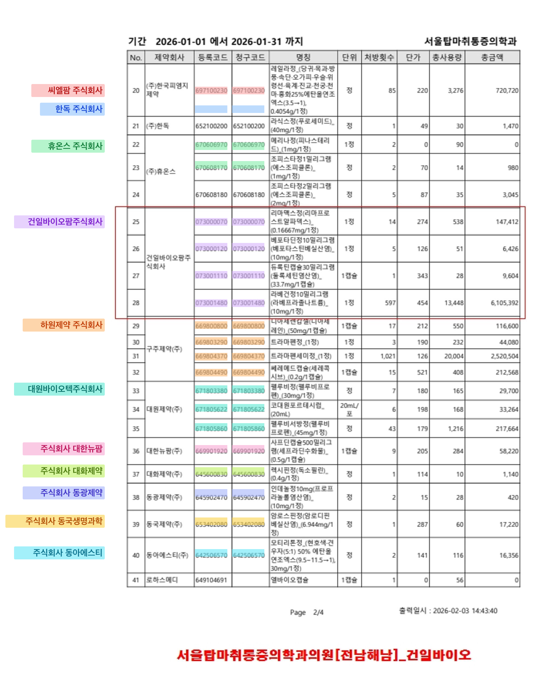

# detect-hira-core-lambda

이미지(처방 내역·EDI 문서) 속 **HIRA 약가코드(9자리)** 를 Gemini OCR로 검출하고, 마스터 데이터에서 **제약사명**을 조회해:

1. **태깅 이미지 생성** — 약가코드 영역을 제약사별 파스텔 색으로 하이라이트하고 왼쪽 여백에 제약사명 라벨 합성 (`lambda.handler` / CLI / 배치)
2. **JSON 추출** — 이미지에 어떤 제약사 약품이 있는지 사업자번호와 함께 반환 (`lambda-extract.handler`)

하는 AWS Lambda 기반 도구입니다.

## Before / After

같은 처방 내역 이미지가 파이프라인을 거치면 이렇게 바뀝니다. 왼쪽 여백에 제약사명이 우측 정렬로 표시되고, 각 약가코드(등록코드·청구코드 두 컬럼 모두)가 제약사별 파스텔 색으로 반투명 하이라이트됩니다. 라벨은 해당 제약사의 첫 번째 코드 행 높이에 정렬되며, 라벨 배경에 동일한 색을 깔아 박스와 정확히 매칭됩니다.

| Before (원본) | After (태깅 결과) |
|---|---|
|  |  |

- 마스터에 없는 코드(예: 미등재 신규 코드)는 하이라이트되지 않습니다 — 의도된 동작이며, 해당 코드는 stdout/CloudWatch 에 `마스터 미조회 코드` 로 로깅됩니다.
- 단일 제약사 문서는 태깅을 생략하고 원본을 그대로 반환합니다 (대부분의 처방전이 해당).

## 동작 흐름

```
원본 이미지
  → 전처리 (리사이즈/JPEG, 토큰 절약)           preprocess.ts
  → [1차] Gemini 회전 판별 (0/90/180/270)        ocr.ts
  → 회전 보정 (필요시 Sharp rotate)             preprocess.ts
  → [2차] Gemini Flash OCR (9자리 코드+좌표)     ocr.ts
  → 마스터 조회 (drug_code → 제약사명)           master.ts
  → 유니크 제약사 수 계산
  → 단일 제약사? → 요약만 출력 (annotate 스킵)
  → 멀티 제약사? → 왼쪽 400px 라벨 + 파스텔 채움  annotate.ts
  → 결과 이미지 + 검출 요약
```

### 핵심 특징 (v0.3)

- **회전 감지**: EXIF 무시, Gemini가 픽셀을 직접 보고 4-way(0/90/180/270) 회전 판별. confidence 0.6 미만이면 미적용(오판 방지).
- **단일 제약사 스킵**: 조회 결과가 1종 제약사면 annotate를 건너뛰고 요약만 출력 (대부분의 처방전이 해당).
- **멀티 제약사 라벨**: 2종 이상일 때만 왼쪽 400px 여백에 제약사명을 **우측 정렬**로 표시. 약가코드는 제약사별 **파스텔 반투명 채움**(테두리·연결선 없음)으로 하이라이트하고, 라벨에도 **동일한 반투명 하이라이트**를 깔아 색으로 정확히 매칭. 파스텔 20색 팔레트.
- **배율 일관성**: 가로폭 1600px 미만 저해상도 원본은 annotate 전에 업스케일 — 라벨 영역(400px 고정)이 문서 대비 과대해지는 것을 방지.
- **bbox 정확도**: Gemini 표준 규약(`box_2d`, `[ymin,xmin,ymax,xmax]` 0~1000 정규화)을 사용. 좌표는 비율이므로 전처리 리사이즈와 무관하게 원본 크기로 정확히 역변환된다.
- **반복 루프 방어**: 같은 코드의 근접 중복 박스(IoU>0.5)는 병합. 검출 수가 유니크 코드 수의 2.5배를 넘으면(반복 생성 의심) 같은 모델로 최대 2회 재시도하고, 그래도 해소되지 않으면 상위 모델(`OCR_FALLBACK_MODEL`)로 1회 에스컬레이션. 폴백 실패 시에도 기존 결과를 유지.
- **일시 오류 백오프**: 모든 Gemini 호출은 네트워크/쿼터성 일시 오류에 대해 지수 백오프로 최대 3회 재시도 (병렬 배치에서 관측된 `exception posting request` 대응).
- **알 수 없음 제외**: 마스터에 없는 코드는 표시에서 제외 (색칠 안 된 코드 = 마스터 미등재).


## 빠른 시작

### 1. 의존성 설치

```bash
npm install
```

### 2. 환경 설정

```bash
cp .env.example .env
# .env 편집: VERTEX_PROJECT_ID, GOOGLE_APPLICATION_CREDENTIALS_JSON 등 입력
# (vertex.txt 에 접속정보가 있으나 해당 파일은 커밋 금지)
```

### 3. 실행

```bash
npx tsx --env-file=.env src/index.ts <입력이미지> [출력이미지]
```

예:

```bash
npx tsx --env-file=.env src/index.ts "edi-data/한국의원_한풍제약.jpg" output/result.png
```

또는 npm 스크립트:

```bash
npm run start -- "edi-data/처방전.jpg" output/result.png
```

## 환경변수

| 변수 | 설명 | 기본값 |
|---|---|---|
| `MODEL_PROVIDER` | 모델 제공자 | `vertex` |
| `MODEL_NAME` | Gemini 모델명 | `gemini-3.1-flash-lite` |
| `OCR_FALLBACK_MODEL` | 반복 루프가 재시도로도 해소 안 될 때만 에스컬레이션할 상위 모델 | `gemini-3.5-flash` |
| `VERTEX_PROJECT_ID` | GCP 프로젝트 ID | (필수) |
| `VERTEX_LOCATION` | GCP 리전. **Gemini 3.x 는 `global` 필수** (리전 엔드포인트는 404) | `us-central1` |
| `GOOGLE_APPLICATION_CREDENTIALS_JSON` | 서비스 계정 JSON (한 줄) | (vertex.txt 방식) |
| `VERTEX_API_KEY` | Express mode API 키 | (대체 인증) |
| `DRUG_MASTER_PATH` | 약가코드 마스터 CSV 경로 | ecso-projects/.../drug_master_merged.csv |
| `MANUFACTURER_MASTER_PATH` | 제약사 마스터 CSV 경로 (업체명→사업자번호) | ecso-projects/.../manufacturer_master_20260620.csv |
| `PREPROCESS_MIN_SHORT_EDGE` | 짧은 변 최소 px (미만이면 스케일 업) | `1000` |
| `PREPROCESS_MAX_LONG_EDGE_CAP` | 긴 변 상한 px (초과 시 축소, 짧은 변 최소값 우선) | `4096` |
| `PREPROCESS_JPEG_QUALITY` | JPEG 재인코딩 화질 | `88` |
| `FONT_PATH` | 한글 폰트 파일 경로 | 시스템 기본 |

## 이미지 전처리 (토큰/비용 절약)

Gemini는 **768px 타일 단위**로 이미지를 토큰화합니다:

```
tiles = ceil(width / 768) × ceil(height / 768)
total_image_tokens = tiles × 258
```

긴 변이 769px만 넘어도 타일이 1→4로 점프합니다. 본 도구는 종횡비를 보존하며 **짧은 변 최소 1000px 보장**(작은 글씨 OCR 정확도), **긴 변 4096px 상한**(토큰 과다 방지)으로 리사이즈합니다. 두 조건 충돌 시 짧은 변 최소값을 우선합니다.

bbox 는 0~1000 정규화 좌표라 종횡비만 보존되면 리사이즈 여부와 무관하게 원본 좌표로 정확히 역변환됩니다.

실제 측정 (edi-data 9장):

| | 전처리 전 | 전처리 후 |
|---|---|---|
| 파일 크기 합계 | 28.2MB | 1.3MB (**95% 절감**) |
| 최대 이미지 토큰 | 14,448 | 1,032 (**14배 절감**) |

VLM이 스스로 이미지를 보정하므로 그레이스케일/CLAHE/이진화는 하지 않습니다 (오히려 정확도 하락). 회전은 EXIF가 아닌 Gemini 판별로 처리합니다.

## 모듈 구조

| 파일 | 역할 |
|---|---|
| `src/preprocess.ts` | Sharp 리사이즈/JPEG 전처리, 토큰 추정, 회전 보정(applyRotation) |
| `src/ocr.ts` | Vertex Gemini 호출 — 회전 판별(detectRotation) + 약가코드 OCR(detectHiraCodes) |
| `src/master.ts` | drug_master CSV 로드 → Map (캐싱), drug_code 조회 |
| `src/annotate.ts` | Sharp + SVG로 400px 여백(제약사명 우측 정렬) + 파스텔 반투명 채움 합성 |
| `src/index.ts` | CLI 진입점, 파이프라인 연결 (회전→OCR→조회→조건부 annotate) |
| `src/batch.ts` | 배치 실행 (`npm run batch`) — 디렉토리 일괄 처리 + CSV 요약, 원본 파일명 유지 |
| `src/lambda.ts` | AWS Lambda 핸들러 — 태깅 이미지 생성 |
| `src/lambda-extract.ts` | AWS Lambda 핸들러 — 약가코드/제약사 JSON 추출 전용 (이미지 합성 없음) |
| `src/types.ts` | 공용 타입 |

## 출력 예시

**단일 제약사 (annotate 스킵):**

```
▶ 입력: 한국의원_한풍제약.jpg (167KB)
▶ 전처리: 1536x1086 JPEG 77KB | 4타일 ≈1032토큰 (리사이즈됨)
▶ 회전 판별 중 (Gemini)...
  회전: 270° (confidence=0.85)
▶ 회전 보정 적용: 270°
▶ OCR 호출 중 (Gemini)...
▶ 검출: 3건
검출 3건 (조회 성공 3건), 제약사 1종, 이미지 1654x2340
  [1] ✓ 658107190 → 한풍제약 주식회사 (아제나정(아젤라스틴염산염))
  [2] ✓ 658107210 → 한풍제약 주식회사 (파모나정20밀리그램(파모티딘))
  [3] ✓ 658107480 → 한풍제약 주식회사 (마만틴정(메만틴염산염))
▶ 단일 제약사(한풍제약 주식회사) — 태깅 생략
```

**멀티 제약사 (annotate 수행):** 2종 이상일 때만 왼쪽 400px 여백에 제약사명을 우측 정렬로 표시하고, 약가코드 영역을 제약사별 파스텔 색으로 반투명 하이라이트합니다(테두리·연결선 없음, 색으로 매칭). 마스터에 없는 코드(✗)는 표시에서 제외됩니다.

### 배치 실행

```bash
npm run batch                              # edi-data → output/batch
npm run batch -- edi-data output/batch_v3  # 디렉토리 지정
```

디렉토리의 모든 이미지(jpg/png)를 처리해 멀티 제약사 건만 태깅 이미지를 저장하고, `batch_results.csv` 요약을 남깁니다. 출력 파일명은 원본 파일명 그대로(확장자만 `.png`) 유지합니다. 동시 실행 수는 `BATCH_CONCURRENCY`(기본 8)로 조절합니다.

### 사용량 집계 (호출 수 / 토큰 / 지연시간)

모든 Gemini 호출은 용도·모델별로 호출 수, 입력/출력 토큰(`usageMetadata`), 평균 지연시간이 자동 집계됩니다. CLI·배치는 종료 시 stdout에, Lambda는 요청마다 CloudWatch에 출력합니다:

```
Gemini 사용량 집계:
  rotation(gemini-3.1-flash-lite): 호출 1회 | 평균 2656ms | 입력 1,316 / 출력 11 토큰
  ocr(gemini-3.1-flash-lite): 호출 1회 | 평균 7821ms | 입력 1,513 / 출력 2,454 토큰
  합계: 호출 2회 | 평균 5239ms | 총 5,294 토큰 (입력 2,829 / 출력 2,465)
```

집계 키는 `용도(모델명)` — 용도는 `rotation` / `ocr` / `ocr-retry`(반복 루프 재시도) / `ocr-fallback`(상위 모델 에스컬레이션). 프로그램에서는 `getUsageStats()` / `resetUsageStats()` (src/ocr.ts) 로 접근합니다.


## Lambda 호출 방식

Lambda 는 두 개의 핸들러를 제공합니다. 입력 방식(아래 4가지)은 공통입니다.

| 핸들러 | 용도 | 출력 |
|---|---|---|
| `lambda.handler` | 태깅 이미지 생성 | JSON + 결과 이미지 (S3 presigned URL 또는 base64) |
| `lambda-extract.handler` | 약가코드/제약사 추출 | JSON 전용 (이미지 합성 없음) |

### 입력 (4가지, 우선순위 순)

**① S3 참조 (고용량 이미지 권장)**

```json
POST /handler
Content-Type: application/json

{
  "inputBucket": "my-input-bucket",
  "inputKey": "edi-data/처방전.jpg"
}
```
- `inputBucket` 생략 시 환경변수 `S3_INPUT_BUCKET` 사용
- API Gateway 10MB 제한 우회 → 15MB+ 고용량 이미지 처리 가능

**② 원격 URL (presigned GET 등 — 고용량 이미지, 버킷 설정 불필요)**

```json
POST /handler
Content-Type: application/json

{ "imageUrl": "https://my-bucket.s3.amazonaws.com/처방전.jpg?X-Amz-..." }
```
- 클라이언트가 자체 S3(또는 임의 스토리지)에 올리고 presigned GET URL 만 전달하는 패턴
- Lambda 에 입력 버킷 권한/설정 없이 페이로드 제한을 우회 (https 만 허용)

**③ base64 JSON (소형 이미지)**

```json
POST /handler
Content-Type: application/json

{ "image": "<base64 인코딩된 이미지>" }
```

**④ 바이너리 직접 업로드 (Function URL)**

```bash
curl -X POST "$FUNCTION_URL" \
  -H "Content-Type: image/jpeg" \
  --data-binary @처방전.jpg
```

### 출력

| 조건 | 결과 이미지 반환 방식 |
|---|---|
| `S3_OUTPUT_BUCKET` 설정됨 | 결과를 S3에 PUT → presigned URL 반환 (`output.url`) — **크기 제한 없음, 고용량 권장** |
| 미설정 | base64를 응답 body에 직접 포함 (`image`, `imageContentType`) |

**고용량 결과 이미지 처리 (base64 폴백 시):** Lambda 응답 페이로드는 6MB 하드 리밋이 있습니다. 결과 이미지가 인라인 한도(4.3MB)를 넘으면 ① JPEG 재인코딩 → ② 긴 변 3072px 다운스케일 순으로 자동 축소하고, 축소가 적용되면 응답에 `imageReduced`(`"jpeg"` 또는 `"jpeg+downscale"`) 필드가 붙습니다. 그래도 초과하면 `S3_OUTPUT_BUCKET` 설정을 안내하는 오류를 반환합니다. 원본 해상도 결과가 필요하면 S3 출력을 사용하세요.

**응답 예 (S3 출력 시):**

```json
{
  "items": [
    { "code": "658107190", "manufacturer": "한풍제약 주식회사", "drugName": "아제나정(...)", "found": true }
  ],
  "uniqueManufacturers": ["한풍제약 주식회사"],
  "width": 1654,
  "height": 2340,
  "tagged": false,
  "output": { "bucket": "...", "key": "annotated/...png", "url": "https://...presigned..." },
  "imageUrl": "https://...presigned..."
}
```

- `tagged: false` → 단일 제약사라 annotate 안 함. **원본 이미지(회전 보정 적용본)가 그대로 반환**됨 (`imageUrl` 또는 base64 `image`, `imageContentType` 은 원본 포맷)
- `tagged: true` → 멀티 제약사라 라벨 합성 PNG 반환 (`imageUrl` 에서 다운로드)

### 약가코드/제약사 추출 API (`lambda-extract.handler`)

이미지를 복수 제약사에 공급하기 전에 **"이 이미지에 어떤 제약사 약품이 들어있는지"** 만 JSON 으로 빠르게 판별하는 엔드포인트입니다. 이미지 합성(annotate)·S3 출력·폰트가 전혀 필요 없으므로 별도 Lambda 함수(핸들러 `lambda-extract.handler`)로 배포합니다.

- 입력: 위 3가지 방식 동일 (S3 참조 / base64 JSON / binary body)
- 처리: 전처리 → 회전 판별/보정 → OCR → 코드 dedupe(등록·청구코드 중복 제거) → 마스터 조회
- 출력: JSON 전용

**응답 스펙:**

| 필드 | 타입 | 설명 |
|---|---|---|
| `manufacturers` | `{ name, businessNumber, codes[] }[]` | 제약사별 약가코드 그룹 (핵심 필드). `businessNumber` = 제약사 마스터(manufacturer_master CSV)의 사업자번호, 업체명 미매칭 시 null |
| `uniqueManufacturers` | `string[]` | 검출된 제약사명 목록 |
| `multiManufacturer` | `boolean` | 2종 이상 제약사 포함 여부 |
| `items` | `{ code, manufacturer, drugName, found }[]` | 코드 단위 조회 결과 (중복 제거됨) |
| `detectedCodes` | `number` | 검출된 유니크 코드 수 |
| `unknownCodes` | `string[]` | 마스터에 없는 코드 |
| `rotation` | `number` | 적용된 회전 보정 각도 (0/90/180/270) |

**응답 예:**

```json
{
  "manufacturers": [
    { "name": "건일바이오팜주식회사", "businessNumber": "6848801858", "codes": ["073000070", "073000120", "073001110", "073001480"] },
    { "name": "휴온스 주식회사", "businessNumber": "8638700270", "codes": ["670608170", "670608180"] }
  ],
  "uniqueManufacturers": ["건일바이오팜주식회사", "휴온스 주식회사"],
  "multiManufacturer": true,
  "items": [
    { "code": "073000070", "manufacturer": "건일바이오팜주식회사", "drugName": "리마맥스정(...)", "found": true },
    { "code": "670606970", "manufacturer": null, "drugName": null, "found": false }
  ],
  "detectedCodes": 7,
  "unknownCodes": ["670606970"],
  "rotation": 0
}
```

**호출 예 (base64 JSON):**

```bash
curl -X POST "$EXTRACT_FUNCTION_URL" \
  -H "Content-Type: application/json" \
  -d "{\"image\": \"$(base64 -i 처방전.jpg)\"}"
```

### 관련 환경변수

| 변수 | 설명 | 필수 |
|---|---|---|
| `S3_INPUT_BUCKET` | 입력 이미지 S3 버킷 (요청에 inputBucket 없을 때 사용) | S3 입력 시 |
| `S3_OUTPUT_BUCKET` | 결과 이미지 업로드 S3 버킷 | S3 출력 시 |
| `S3_PRESIGN_TTL` | presigned URL 만료 시간(초). 기본 3600 | 아니오 |

### 배포 메모 (타임아웃·재시도 특성)

- 모든 재시도는 **동기(호출 대기)** 로 동작합니다. 정상 경로는 Gemini 2회 호출(회전+OCR, 수 초)이지만, 최악 경로는 일시 오류 백오프(호출당 최대 3회, 대기 ~11초) + 반복 루프 재시도(최대 2회) + 폴백 모델 1회까지 수십 초가 걸릴 수 있습니다.
- **Lambda timeout 은 120초 이상** 권장. API Gateway HTTP API 는 29초 하드 리밋이 있어 최악 경로에서 504가 날 수 있으므로 **Function URL**(최대 15분) 사용을 권장합니다.
- 마스터 CSV(약 22MB)는 cold start 시 1회 로드 후 컨테이너 수명 동안 캐시됩니다. 마스터/폰트는 Lambda Layer 또는 S3 에서 로드하도록 경로를 환경변수로 지정하세요.
- `sharp` 는 배포 아키텍처(arm64/x64)에 맞는 네이티브 바이너리로 설치해야 합니다 (`npm install --cpu=arm64 --os=linux sharp`).


## 라이선스

본 프로젝트 코드: MIT

의존성 (모두 퍼미시브 라이선스):
- `sharp` — Apache-2.0
- `@google-cloud/vertexai` — Apache-2.0
- `google-auth-library` — Apache-2.0
- `@aws-sdk/client-s3`, `@aws-sdk/s3-request-presigner` — Apache-2.0
- `csv-parse` — MIT

## 참고 사항

- `@google-cloud/vertexai` SDK는 **2026년 6월 24일 deprecated** 예정입니다. 장기적으로는 새 SDK(`@google/genai`)로 마이그레이션해야 합니다. 구 SDK가 `global` 리전 엔드포인트를 잘못 조립하는 문제는 `resolveApiEndpoint()`(src/ocr.ts)로 보정되어 있습니다.
- bounding box 는 반드시 Gemini 학습 규약인 **`box_2d` 필드명 + `[ymin,xmin,ymax,xmax]` 0~1000 정규화**로 받아야 합니다. 임의 필드명(`box` 등)을 쓰면 모델별로 좌표 해석이 흔들려 박스가 행 단위로 어긋나는 문제가 실측으로 확인됐습니다.
- 일부 모델(3.1-flash-lite)은 같은 코드가 두 컬럼에 나와도 한 곳만 반환하려는 경향이 있어, 프롬프트에 "보이는 모든 위치를 각각 반환"을 명시해야 두 컬럼이 모두 하이라이트됩니다.
- 정확도가 부족하면 `MODEL_NAME`을 상위 모델(`gemini-3.5-flash` 등)로 변경해 보세요.
